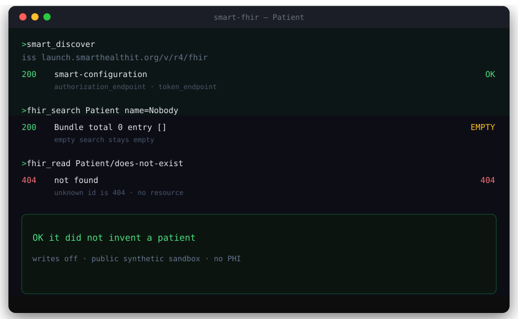

<div align="center">

# smart-fhir

**A connector that will not invent a patient.**

[](#tools)
[](#install)
[](https://hl7.org/fhir/R4/)
[](https://hl7.org/fhir/smart-app-launch/)
[](#limits)

[](#tools)
[](#how-it-works)
[](#how-it-works)
[](#how-it-works)
[](#limits)

<br>

[Install](#install) · [Tools](#tools) · [How it works](#how-it-works) · [Limits](#limits)

</div>

<br>



---

## Install

stdio only. After the TypeScript build, add a local connector:

```
name: smart-fhir
command: node
args: dist/index.js
```

```bash
npm install
npm run build
```

Env for that add (defaults, not secrets):

```
FHIR_ISS = https://launch.smarthealthit.org/v/r4/fhir
FHIR_VERSION = R4
FHIR_AUTH_MODE = open
FHIR_WRITE = off
FHIR_AUDIT_PATH = ./audit/audit.jsonl
```

Do not put secret values in the repo. No public HTTP port. Do not bind TCP.

### Morning shortcut (same env)

```bash
npx -y tsx src/index.ts
```

See `package.json` scripts: install, build, test, prove.

## Tools

Four tools. No create / update / delete.

| Tool | Action |
| --- | --- |
| `smart_discover` | GET `{iss}/.well-known/smart-configuration`. Parsed JSON or explicit error. Does not invent endpoints. |
| `fhir_auth_status` | `{ mode, iss, fhir_version: "R4", write: "off", token_present, discovery_ok, last_error? }`. Never prints token or PEM. |
| `fhir_search` | GET `{iss}/{resourceType}?...` `_count` default 10, max 50. One page. Empty Bundle is returned as-is. |
| `fhir_read` | GET `{iss}/{resourceType}/{id}`. 404 is not found, not a made-up resource. |

**resourceType allowlist:** Patient | Observation | Condition | MedicationRequest | Encounter. Anything else → `{ ok: false, error: "resourceType not in v1 allowlist" }`.

## How it works

`FHIR_VERSION` must be `R4`. Anything else refuses to start.

| What | URL | How to read it |
| --- | --- | --- |
| FHIR index (published page is **R5 5.0.0**) | http://hl7.org/fhir/ | Official index only. **Not implemented.** |
| FHIR **R4** (v1) | https://hl7.org/fhir/R4/ | FHIR Release 4, **4.0.1**. Resource model. |
| SMART App Launch **2.2.0** (STU 2.2) | https://hl7.org/fhir/smart-app-launch/ | Current published SMART IG. **Based on FHIR R4.** |
| App launch + authorization | https://hl7.org/fhir/smart-app-launch/app-launch.html | Discovery, standalone/EHR launch, PKCE, token. **App Launch (code+PKCE) is out of v1.** |
| Backend Services | https://hl7.org/fhir/smart-app-launch/backend-services.html | client_credentials + private-key JWT. Implemented; unused unless env is set. |

**ISS allowlist** (trailing slash stripped, anything else refused):

- `https://launch.smarthealthit.org/v/r4/fhir` (default)
- `https://r4.smarthealthit.org`
- `https://hapi.fhir.org/baseR4`

Set `FHIR_ISS` to another allowlisted base to point at a later ISS. A new ISS needs a review first. Do not point this at a live EHR without that review plus a real `client_id`.

| FHIR_AUTH_MODE | Behavior |
| --- | --- |
| `open` (default) | Discover, then FHIR GET without Authorization. Discovery 404 is not fatal in open (logged; continue). 401/403 FHIR → `{ ok: false, http_status, ... }`. |
| `bearer` | Same discovery. FHIR GET with Authorization Bearer token. |
| `backend_jwt` | Only if both `FHIR_CLIENT_ID` (or `SMART_CLIENT_ID`) and `FHIR_PRIVATE_KEY_PEM` exist. SMART Backend Services JWT. Missing env → refuse to start. Does not invent credentials. |

App Launch (code+PKCE) is **out**. `FHIR_REDIRECT_URI` is reserved and unused.

Auth failure shape: `{ ok: false, http_status, issue?, error? }`. Never a synthetic Patient.

`FHIR_WRITE` defaults `off`. v1 has **no write tools** even if someone sets `on`. Writes never POST AuditEvent to FHIR.

| Name | Default | Notes |
| --- | --- | --- |
| FHIR_ISS | default launcher R4 | Must stay allowlisted |
| FHIR_VERSION | R4 | Reject anything else |
| FHIR_AUTH_MODE | open | open / bearer / backend_jwt |
| FHIR_WRITE | off | Writes stay off in v1 |
| FHIR_AUDIT_PATH | `./audit/audit.jsonl` | Append-only JSONL |
| FHIR_ACCESS_TOKEN | unset | Bearer only |
| FHIR_CLIENT_ID | unset | Backend Services |
| SMART_CLIENT_ID | unset | Alias of FHIR_CLIENT_ID |
| FHIR_PRIVATE_KEY_PEM | unset | Backend Services JWT |
| FHIR_JWKS_URL | unset | Reserved if an EHR wants JWKS |
| FHIR_SCOPE | five system/*.rs types | JWT mode override |
| FHIR_REDIRECT_URI | unset | Reserved for later App Launch |

Audit lines: ts, tool, iss, mode, resourceType, id?, http_status, entry_count?. No resource body, no token, no PEM, no name/MRN query values.

## Limits

- R5 / R4B as default. Extra resource types. CRUD. Bulk. App Launch browser/PKCE.
- Real EHR / real PHI. Production deploy. Public bind or Streamable HTTP.
- momentum / fhirhydrant / Atrium / Pinecone / Medplum.
- Not a medical product. Does not diagnose, treat, or store PHI.

---

<div align="center">

No PHI. No live EHR.

</div>
